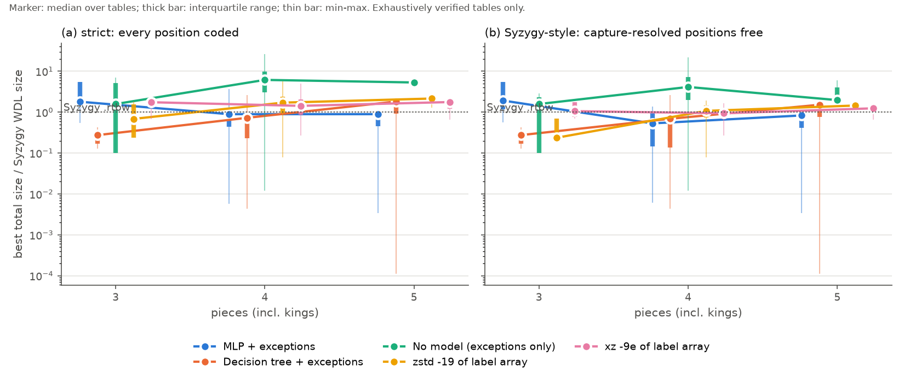
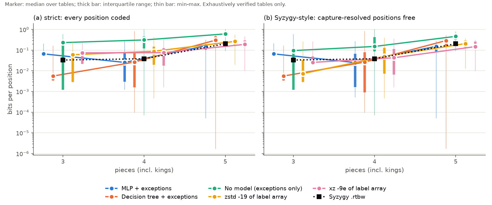
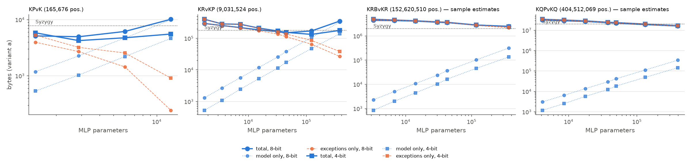
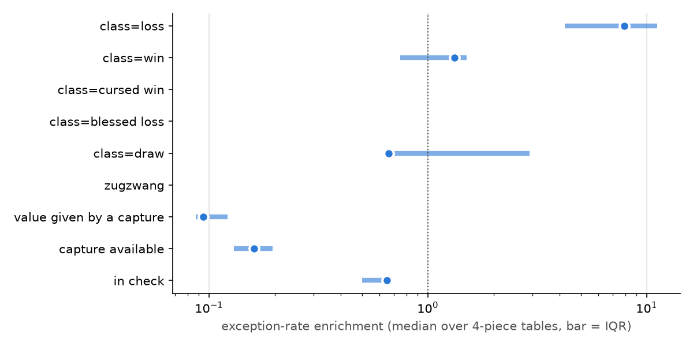

# How compressible is perfect chess play?

**A scaling experiment on Syzygy WDL endgame tablebases: small neural network
+ exception list vs. Syzygy, as a function of the number of pieces.**

> Status: 3-piece (5/5 tables) and 4-piece (30/30) exhaustive; 5-piece: a representative
> subset of 10 tables (sample-based size selection, exact full-table encoding and
> verification). 6-piece: not measured (see [`docs/SIX_PIECE.md`](docs/SIX_PIECE.md)).
> Every number in the tables below was decoded from its bytes and matched Syzygy on
> every position.

## Question

Syzygy WDL tables store, for every legal position of an endgame, whether the
side to move wins, loses or draws (with 50-move-rule nuances: 5 classes).
Encode the same information **losslessly** as

    small MLP (quantised weights)  +  list of positions where the MLP is wrong

and measure the total size relative to the official `.rtbw` file. How does
this ratio change as the number of pieces grows (3 → 4 → 5)? If it improves,
perfect play has structure that grows with the piece count and that a small
learned model captures; if it worsens, the extra information is essentially
irregular. Both outcomes are informative; the result was not assumed in
advance.

## Prior work (not repeated here)

* **University of Reading, 1998** — a neural network plus a residual file of
  misclassified positions for a single endgame (KPK).
* **Compressing Chinese Dark Chess endgame databases with deep learning, 2018.**
* **ACG 2021** — lossless compression of chess endgame data by two-level logic
  minimisation.
* **ECAI 2024, "Comparing Lossless Compression Methods for Chess Endgame
  Data"** — decision trees, decision diagrams and logic minimisation compared
  with Syzygy; Syzygy is the most compact. No neural networks.

Contribution of this repository: a systematic measurement of the **scaling
curve** of NN-based lossless coding with the number of pieces, with an
MDL-style model-size sweep, a fair comparison with Syzygy (two variants,
see below) and a bit-exact lossless verification of every reported number.

## Short answer



* **MLP + exceptions is smaller than Syzygy in aggregate at every piece count
  measured, and the ratio does not get worse from 4 to 5 pieces.** Pooled over
  the tables of a piece count (sum of our bytes / sum of Syzygy bytes), strict
  variant (a): 0.69 (3 pieces) → 0.77 (4) → 0.74 (5); Syzygy-style variant
  (b): 0.71 → 0.65 → 0.65 (see the table below for the final 5-piece value).
* **The spread between tables is huge** (from 0.003 to 5.6 × Syzygy). Tiny
  or trivial tables are dominated by the fixed model cost (≈ 300–1000 bytes;
  Syzygy stores KBvK in 80 bytes), trivial "one side always wins" tables
  collapse to almost nothing, and the hard, large tables sit around 0.5–1.2.
* **Decision trees scale badly**: 0.41 → 0.87 → 1.3 × Syzygy (pooled, a).
  Generic compressors on the raw label array stay around 1× (xz) or worse.
* **The 5-piece numbers are an upper bound for this model family.** On every
  hard 5-piece table the largest model we could afford on 4 CPU cores
  (≈ 400K parameters, 12K training steps on a 16M-position sample) was still
  the best one — the MDL curve had not turned up yet (figure below). A bigger
  budget would most likely lower the 5-piece ratios; the 3- and 4-piece
  optima are inside the sweep.
* **Part of the gain comes from giving the decoder a move generator.** The
  model sees three cheap move-generator features (in check, number of legal
  captures, number of legal moves). Without them trivial tables lose most of
  their advantage (KQQvK: 0.046 → 1.64; KQRBvK: 0.003 → 2.07), while hard
  tables change little (KRvKP 0.74 → 0.90, KPvKP 0.47 → 0.52,
  KQRvKR (b) 0.66 → 0.70). Syzygy's own decoder also searches captures, so
  this is not free information, but it has to be kept in mind.
* So, to the question asked: **we see no sign that perfect play becomes less
  compressible per unit of Syzygy size as pieces are added; within the
  compute limits the NN ratio is flat-to-improving, while hand-built
  structure (trees) and generic compressors degrade.** Whether it keeps
  improving (the "growing structure" hypothesis) cannot be settled with 3
  points, a 10-table 5-piece subset and an unconverged 5-piece MDL sweep.





*MDL curves: total size (thick), model only (dotted), exceptions only
(dashed) against model size. KPvK and KRvKP (exhaustive) have an interior
optimum; KRBvKR and KQPvKQ (5 pieces, sample estimates) are still decreasing
at the largest size tried.*

## Results

All ratios are *our total bytes / size of the official Syzygy `.rtbw`*.
Variant (a) codes every position; variant (b) lets positions whose value is
given by a capture be resolved at decode time by a 1-ply capture search, as
Syzygy does. "MLP choice" is the configuration picked by the MDL sweep
(embedding width, hidden widths), its weight precision and parameter count.
All numbers: `results/summary.csv`, `results/summary_by_pieces.csv`,
`results/tables/*.json`.

<!-- RESULTS:BEGIN -->
### Scaling summary (ratio = our total bytes / Syzygy .rtbw bytes; < 1 means smaller than Syzygy)

Pooled = sum over the tables of that piece count; median = median of per-table ratios.

| pieces | variant | tables | Syzygy total (KB) | mlp pooled / median | tree pooled / median | const pooled / median | zstd19 pooled / median | xz9e pooled / median | all verified |
|---|---|---:|---:|---|---|---|---|---|---|
| 3 | a | 5 | 8.3 | 0.691 / 1.8 | 0.409 / 0.275 | 1.8 / 1.58 | 0.732 / 0.685 | 0.775 / 1.75 | yes |
| 3 | b | 5 | 8.3 | 0.709 / 1.92 | 0.409 / 0.275 | 1.61 / 1.58 | 0.671 / 0.237 | 0.723 / 1.06 | yes |
| 4 | a | 30 | 1,224.8 | 0.774 / 0.894 | 0.871 / 0.727 | 4.37 / 6.16 | 1.44 / 1.71 | 1.25 / 1.43 | yes |
| 4 | b | 30 | 1,224.8 | 0.652 / 0.532 | 0.852 / 0.69 | 3.69 / 4.14 | 1.19 / 1.07 | 1.03 / 0.939 | yes |
| 5 | a | 9 | 65,099.4 | 0.744 / 0.781 | 1.32 / 1.18 | 2.76 / 3.86 | 1.2 / 1.3 | 0.931 / 0.958 | yes |
| 5 | b | 9 | 65,099.4 | 0.65 / 0.655 | 1.21 / 1.09 | 2.26 / 1.81 | 0.952 / 0.859 | 0.758 / 0.734 | yes |

### Per table (ratios to Syzygy)

| table | positions | Syzygy KB | MLP (a) | tree (a) | xz (a) | MLP (b) | tree (b) | xz (b) | MLP (a) choice | MLP bits/pos (a) | verified |
|---|---:|---:|---:|---:|---:|---:|---:|---:|---|---:|---|
| KBvK | 52,234 | 0.1 | 5.51 | 0.275 | 1.75 | 5.51 | 0.275 | 1.75 | (4, []) 4b, 989 p. | 0.0675 | yes |
| KNvK | 53,806 | 0.1 | 5.56 | 0.275 | 1.75 | 5.54 | 0.275 | 1.75 | (4, []) 4b, 989 p. | 0.0662 | yes |
| KRvK | 50,015 | 0.2 | 1.8 | 0.168 | 2.23 | 1.92 | 0.168 | 0.769 | (4, []) 4b, 989 p. | 0.0600 | yes |
| KQvK | 46,137 | 0.3 | 1.28 | 0.129 | 1.91 | 1.19 | 0.129 | 1.06 | (4, []) 4b, 989 p. | 0.0605 | yes |
| KPvK | 165,676 | 7.6 | 0.542 | 0.428 | 0.676 | 0.562 | 0.428 | 0.689 | (8, []) 4b, 2,869 p. | 0.2046 | yes |
| KNvKN | 1,567,222 | 1.1 | 0.511 | 0.0522 | 0.325 | 0.511 | 0.0522 | 0.329 | (4, []) 4b, 1,309 p. | 0.0030 | yes |
| KBvKB | 1,479,198 | 1.2 | 0.434 | 0.0568 | 0.367 | 0.438 | 0.0568 | 0.37 | (4, []) 4b, 1,309 p. | 0.0029 | yes |
| KNNvK | 1,573,368 | 1.3 | 0.421 | 0.125 | 0.412 | 0.424 | 0.125 | 0.412 | (4, []) 4b, 989 p. | 0.0029 | yes |
| KRRvK | 1,374,940 | 1.9 | 0.177 | 0.016 | 0.733 | 0.177 | 0.016 | 0.733 | (4, []) 4b, 989 p. | 0.0020 | yes |
| KBvKN | 3,046,420 | 2.2 | 0.27 | 0.0332 | 0.27 | 0.268 | 0.0332 | 0.27 | (4, []) 4b, 1,309 p. | 0.0016 | yes |
| KRNvK | 2,946,334 | 2.3 | 1.33 | 0.607 | 2.05 | 0.172 | 0.172 | 0.891 | (8, []) 4b, 2,613 p. | 0.0084 | yes |
| KRBvK | 2,878,883 | 2.8 | 1.22 | 0.559 | 2.55 | 0.137 | 0.454 | 0.756 | (16, [16]) 4b, 5,493 p. | 0.0096 | yes |
| KQNvK | 2,738,690 | 3.5 | 0.909 | 0.609 | 1.62 | 0.108 | 0.238 | 0.859 | (16, [16]) 4b, 5,493 p. | 0.0096 | yes |
| KQRvK | 2,571,940 | 4.5 | 0.0868 | 0.0068 | 0.998 | 0.0868 | 0.0068 | 0.998 | (4, []) 4b, 1,309 p. | 0.0012 | yes |
| KQBvK | 2,670,227 | 4.8 | 0.0858 | 0.00829 | 1.83 | 0.0783 | 0.00829 | 0.91 | (4, []) 4b, 1,309 p. | 0.0013 | yes |
| KRPvK | 9,063,318 | 5.0 | 3.69 | 2 | 4.17 | 0.113 | 1.42 | 0.571 | (32, [32]) 4b, 15,077 p. | 0.0167 | yes |
| KQvKB | 2,598,414 | 6.5 | 1.12 | 0.732 | 4.93 | 1.12 | 0.732 | 1.4 | (32, [32]) 4b, 11,493 p. | 0.0229 | yes |
| KQQvK | 1,208,031 | 6.9 | 0.0459 | 0.00439 | 0.829 | 0.0459 | 0.00439 | 0.829 | (4, []) 4b, 989 p. | 0.0021 | yes |
| KBNvK | 3,067,466 | 7.5 | 1.41 | 0.907 | 2.06 | 1.36 | 0.907 | 1.34 | (32, [32]) 4b, 11,493 p. | 0.0280 | yes |
| KQvKN | 2,686,438 | 9.8 | 1.27 | 1.16 | 2.63 | 1.11 | 1.16 | 1.56 | (32, [32]) 8b, 11,493 p. | 0.0382 | yes |
| KQPvK | 8,398,429 | 12.2 | 1.29 | 0.738 | 1.83 | 0.0467 | 0.521 | 0.465 | (32, [32]) 4b, 15,077 p. | 0.0154 | yes |
| KRvKR | 1,347,906 | 12.6 | 1.01 | 0.672 | 2.77 | 0.901 | 0.672 | 1.02 | (32, [32]) 4b, 11,493 p. | 0.0779 | yes |
| KQvKQ | 1,119,216 | 16.1 | 1.12 | 0.858 | 3.07 | 0.986 | 0.857 | 1.32 | (64, [64]) 4b, 25,029 p. | 0.1319 | yes |
| KQvKR | 2,467,122 | 20.0 | 1.06 | 0.614 | 1.77 | 0.954 | 0.611 | 0.92 | (16, [16]) 8b, 5,493 p. | 0.0704 | yes |
| KPPvK | 3,719,043 | 24.5 | 1.32 | 0.809 | 1.34 | 0.962 | 0.79 | 1 | (64, [128, 64]) 4b, 39,493 p. | 0.0714 | yes |
| KRvKB | 2,827,104 | 32.1 | 1.35 | 1.07 | 2.21 | 1.31 | 1.07 | 1.67 | (64, [64]) 8b, 25,029 p. | 0.1254 | yes |
| KBBvK | 1,489,788 | 56.6 | 0.00571 | 2.62 | 0.392 | 0.00612 | 2.62 | 0.414 | (4, []) 4b, 989 p. | 0.0018 | yes |
| KQvKP | 8,352,472 | 56.7 | 0.83 | 0.825 | 1.75 | 0.567 | 0.767 | 1.17 | (64, [128, 64]) 4b, 44,613 p. | 0.0462 | yes |
| KBPvK | 9,441,347 | 79.5 | 0.862 | 0.817 | 1.46 | 0.673 | 0.796 | 1.21 | (128, [256, 128]) 4b, 121,989 p. | 0.0595 | yes |
| KNPvK | 9,699,457 | 91.0 | 0.948 | 1.07 | 1.23 | 0.878 | 1.05 | 1.09 | (128, [256, 128]) 4b, 121,989 p. | 0.0729 | yes |
| KRvKN | 2,915,128 | 97.7 | 0.987 | 1.04 | 1.13 | 0.96 | 1.04 | 1.11 | (128, [256, 128]) 4b, 107,653 p. | 0.2710 | yes |
| KBvKP | 9,427,184 | 105.0 | 0.7 | 0.866 | 1.39 | 0.553 | 0.847 | 1.33 | (128, [256, 128]) 4b, 121,989 p. | 0.0638 | yes |
| KNvKP | 9,685,770 | 144.6 | 0.88 | 0.869 | 1.32 | 0.782 | 0.854 | 1.37 | (128, [256, 128]) 4b, 121,989 p. | 0.1076 | yes |
| KRvKP | 9,031,524 | 175.2 | 0.743 | 0.722 | 1.09 | 0.638 | 0.708 | 0.958 | (128, [256, 128]) 4b, 121,989 p. | 0.1180 | yes |
| KPvKP | 3,718,044 | 239.6 | 0.47 | 0.536 | 0.659 | 0.455 | 0.53 | 0.659 | (128, [256, 128]) 4b, 136,325 p. | 0.2481 | yes |
| KQRvKR | 134,700,370 | 273.3 | 2.19 | 7.41 | 3.39 | 0.655 | 5.52 | 0.616 | (128, [256, 128]) 8b, 117,893 p. | 0.0365 | yes |
| KQRBvK | 148,512,767 | 274.1 | 0.00342 | 0.00011 | 0.65 | 0.00342 | 0.00011 | 0.65 | (8, []) 4b, 3,253 p. | 0.0001 | yes |
| KRBvKR | 152,620,510 | 1,987.6 | 1.21 | 1.9 | 1.9 | 1.05 | 1.71 | 1.3 | (256, [512, 256]) 4b, 366,853 p. | 0.1295 | yes |
| KQBvKQ | 126,967,682 | 3,996.6 | 0.894 | 1.82 | 1.77 | 0.832 | 1.52 | 1.24 | (256, [512, 256]) 8b, 366,853 p. | 0.2307 | yes |
| KBBvKN | 85,412,684 | 4,945.7 | 0.353 | 1.1 | 0.545 | 0.351 | 1.09 | 0.518 | (256, [512, 256]) 4b, 346,373 p. | 0.1675 | yes |
| KPPvKR | 199,951,960 | 8,856.1 | 0.629 | 0.865 | 0.486 | 0.549 | 0.816 | 0.415 | (256, [512, 256]) 8b, 375,045 p. | 0.2281 | yes |
| KBNvKP | 544,972,696 | 9,908.5 | 1.04 | 1.96 | 1.06 | 0.932 | 1.9 | 0.974 | (256, [512, 256]) 8b, 395,525 p. | 0.1545 | yes |
| KBPvKB | 527,533,761 | 14,932.1 | 0.583 | 1.15 | 0.806 | 0.471 | 1.07 | 0.734 | (256, [512, 256]) 8b, 395,525 p. | 0.1351 | yes |
| KQPvKQ | 404,512,069 | 19,925.4 | 0.781 | 1.18 | 0.958 | 0.696 | 1.01 | 0.734 | (256, [512, 256]) 8b, 395,525 p. | 0.3150 | yes |

### 3-class labels (loss / draw / win, 50-move rule applied)

| pieces | variant | tables | Syzygy total (KB) | mlp pooled / median | tree pooled / median | const pooled / median | xz9e pooled / median | all verified |
|---|---|---:|---:|---|---|---|---|---|
| 3 | a | 5 | 8.3 | 0.691 / 1.8 | 0.409 / 0.275 | 2.15 / 1.96 | 0.775 / 1.75 | yes |
| 3 | b | 5 | 8.3 | 0.709 / 1.92 | 0.409 / 0.275 | 1.96 / 1.96 | 0.723 / 1.06 | yes |
| 4 | a | 4 | 447.4 | 0.618 / 0.878 | 0.616 / 0.643 | 3.16 / 5.67 | 0.937 / 1.43 | yes |
| 4 | b | 4 | 447.4 | 0.562 / 0.77 | 0.608 / 0.642 | 3.4 / 3.49 | 0.798 / 0.939 | yes |


| table | positions | Syzygy KB | MLP (a) | tree (a) | xz (a) | MLP (b) | tree (b) | xz (b) | MLP (a) choice | MLP bits/pos (a) | verified |
|---|---:|---:|---:|---:|---:|---:|---:|---:|---|---:|---|
| KBvK | 52,234 | 0.1 | 5.51 | 0.275 | 1.75 | 5.51 | 0.275 | 1.75 | (4, []) 4b, 989 p. | 0.0675 | yes |
| KNvK | 53,806 | 0.1 | 5.56 | 0.275 | 1.75 | 5.54 | 0.275 | 1.75 | (4, []) 4b, 989 p. | 0.0662 | yes |
| KRvK | 50,015 | 0.2 | 1.8 | 0.168 | 2.23 | 1.92 | 0.168 | 0.769 | (4, []) 4b, 989 p. | 0.0600 | yes |
| KQvK | 46,137 | 0.3 | 1.29 | 0.129 | 1.91 | 1.19 | 0.129 | 1.06 | (4, []) 4b, 989 p. | 0.0609 | yes |
| KPvK | 165,676 | 7.6 | 0.542 | 0.428 | 0.676 | 0.562 | 0.428 | 0.689 | (8, []) 4b, 2,869 p. | 0.2046 | yes |
| KRvKR | 1,347,906 | 12.6 | 1.01 | 0.672 | 2.77 | 0.901 | 0.672 | 1.02 | (32, [32]) 4b, 11,493 p. | 0.0779 | yes |
| KQvKR | 2,467,122 | 20.0 | 1.06 | 0.614 | 1.77 | 0.954 | 0.611 | 0.92 | (16, [16]) 8b, 5,493 p. | 0.0704 | yes |
| KRvKP | 9,031,524 | 175.2 | 0.743 | 0.722 | 1.09 | 0.638 | 0.708 | 0.958 | (128, [256, 128]) 4b, 121,989 p. | 0.1180 | yes |
| KPvKP | 3,718,044 | 239.6 | 0.47 | 0.536 | 0.659 | 0.455 | 0.53 | 0.659 | (128, [256, 128]) 4b, 136,325 p. | 0.2481 | yes |

### Ablation: no move-generator features

| pieces | variant | tables | Syzygy total (KB) | mlp pooled / median | tree pooled / median | const pooled / median | xz9e pooled / median | all verified |
|---|---|---:|---:|---|---|---|---|---|
| 3 | a | 3 | 8.1 | 0.635 / 1.65 | 0.431 / 0.433 | 1.83 / 5.19 | 0.756 / 1.91 | yes |
| 3 | b | 3 | 8.1 | 0.63 / 1.67 | 0.431 / 0.433 | 1.64 / 2.3 | 0.703 / 0.769 | yes |
| 4 | a | 5 | 449.1 | 0.774 / 1.64 | 0.989 / 1.36 | 3.15 / 3.97 | 0.903 / 1.09 | yes |
| 4 | b | 5 | 449.1 | 0.632 / 1.2 | 0.85 / 1.36 | 3.5 / 5.1 | 0.801 / 0.92 | yes |
| 5 | a | 2 | 547.4 | 2.07 / 2.07 | 6.96 / 6.96 | 11.4 / 11.4 | 2.02 / 2.02 | yes |
| 5 | b | 2 | 547.4 | 1.39 / 1.39 | 2.61 / 2.61 | 14.5 / 14.6 | 0.633 / 0.633 | yes |


| table | positions | Syzygy KB | MLP (a) | tree (a) | xz (a) | MLP (b) | tree (b) | xz (b) | MLP (a) choice | MLP bits/pos (a) | verified |
|---|---:|---:|---:|---:|---:|---:|---:|---:|---|---:|---|
| KRvK | 50,015 | 0.2 | 1.65 | 0.245 | 2.23 | 1.81 | 0.245 | 0.769 | (4, []) 4b, 989 p. | 0.0549 | yes |
| KQvK | 46,137 | 0.3 | 1.71 | 0.518 | 1.91 | 1.67 | 0.518 | 1.06 | (4, []) 4b, 989 p. | 0.0808 | yes |
| KPvK | 165,676 | 7.6 | 0.571 | 0.433 | 0.676 | 0.562 | 0.433 | 0.689 | (8, []) 4b, 2,869 p. | 0.2156 | yes |
| KQQvK | 1,208,031 | 6.9 | 1.64 | 1.36 | 0.829 | 1.64 | 1.36 | 0.829 | (4, []) 4b, 989 p. | 0.0764 | yes |
| KBNvK | 3,067,466 | 7.5 | 2.64 | 3.15 | 2.06 | 1.69 | 2.8 | 1.34 | (64, [64]) 4b, 25,029 p. | 0.0526 | yes |
| KQvKR | 2,467,122 | 20.0 | 1.73 | 2.87 | 1.77 | 1.2 | 1.36 | 0.92 | (64, [128, 64]) 4b, 37,445 p. | 0.1147 | yes |
| KRvKP | 9,031,524 | 175.2 | 0.901 | 1.22 | 1.09 | 0.709 | 1.07 | 0.958 | (128, [256, 128]) 4b, 121,989 p. | 0.1431 | yes |
| KPvKP | 3,718,044 | 239.6 | 0.519 | 0.584 | 0.659 | 0.466 | 0.567 | 0.659 | (128, [256, 128]) 4b, 136,325 p. | 0.2741 | yes |
| KQRvKR | 134,700,370 | 273.3 | 2.06 | 12.1 | 3.39 | 0.701 | 3.4 | 0.616 | (256, [512, 256]) 4b, 366,853 p. | 0.0343 | yes |
| KQRBvK | 148,512,767 | 274.1 | 2.07 | 1.83 | 0.65 | 2.07 | 1.83 | 0.65 | (8, []) 8b, 3,253 p. | 0.0313 | yes |

### Effect of the move-generator features (same tables, MLP + exceptions, ratio to Syzygy)

| table | pieces | (a) with | (a) without | (b) with | (b) without |
|---|---:|---:|---:|---:|---:|
| KRvK | 3 | 1.8 | 1.65 | 1.92 | 1.81 |
| KQvK | 3 | 1.28 | 1.71 | 1.19 | 1.67 |
| KPvK | 3 | 0.542 | 0.571 | 0.562 | 0.562 |
| KQQvK | 4 | 0.0459 | 1.64 | 0.0459 | 1.64 |
| KBNvK | 4 | 1.41 | 2.64 | 1.36 | 1.69 |
| KQvKR | 4 | 1.06 | 1.73 | 0.954 | 1.2 |
| KRvKP | 4 | 0.743 | 0.901 | 0.638 | 0.709 |
| KPvKP | 4 | 0.47 | 0.519 | 0.455 | 0.466 |
| KQRvKR | 5 | 2.19 | 2.06 | 0.655 | 0.701 |
| KQRBvK | 5 | 0.00342 | 2.07 | 0.00342 | 2.07 |

### Joint model per piece count (one MLP for all tables)

| pieces | tables | Syzygy KB | variant | MLP arch | bits | model KB | exceptions KB | total / Syzygy | verified |
|---|---:|---:|---|---|---:|---:|---:|---:|---|
| 3 | 5 | 8.3 | a | (16, [16]) | 4 | 4.0 | 3.0 | 0.848 | yes |
| 3 | 5 | 8.3 | b | (16, [16]) | 4 | 4.0 | 3.0 | 0.852 | yes |
<!-- RESULTS:END -->

## Where the exceptions are (4-piece tables, best MLP, variant a)



The exception rate inside a class of positions, relative to the table's
overall exception rate (full table: [`results/error_analysis.md`](results/error_analysis.md)):

* **Zugzwang positions** (the side to move would be better off if it could
  pass) are the most over-represented: 25–355× the table's average exception
  rate wherever they occur (KRvKP, KNvKP, KBvKP, KBPvK, KPPvK, …).
* **Positions whose value comes from a capture**: ~10× in KRPvK, KQPvK,
  KRNvK, KRBvK, KQNvK, KQBvK (variant a). This is exactly what variant (b)
  removes, and why (b) is much smaller for those tables.
* **Draws in mostly-won endgames** (fortress-like draws, stalemate tricks):
  15–26× in KQvKR, KPPvK, KRPvK, KQPvK.
* **Side to move in check**: 2–5× in many pawn endings.
* **Long wins** are over-represented only in some tables: the median |DTZ|
  of mispredicted decisive positions is 32 plies vs 4 for all decisive
  positions in KQvKR and 12 vs 1 in KRvKN; in pawn endings it is about the
  same as the table average.

Example exceptions (FEN, true value → model), more in the file above:

* KRvKP `2K5/8/8/3k4/5R2/8/4p3/8 w - - 0 1` — loss, predicted draw
* KRvKP `8/k7/8/3K1p2/6R1/8/8/8 b - - 0 1` — draw, predicted win
* KQvKR, KQvKQ, KRvKR: draws predicted as wins and vice versa near
  checking sequences (see file).

## Scope, and what was not done

* **5 pieces: 10 of 110 tables**, chosen before any 5-piece result was seen
  (list and reasons in [`docs/METHOD.md`](docs/METHOD.md) §10). One 5-piece
  table takes 2–4 CPU-hours for the sweep plus exact encoding; all 110 would
  not have fit in the session.
* **5-piece size selection is sample-based** (16M training sample, 4M
  evaluation positions in 64 blocks); only the chosen configuration is encoded
  and verified on the full table. For the chosen configurations the estimate differed
  from the exact full-table value by 0–16% (mostly 1–8%, usually on the low
  side; `est_total_bytes` vs `total_bytes` in the JSON), so the chosen size
  may not be the exact optimum of the sweep.
* **6 pieces: not measured.** The download host is blocked and the generator
  needs 2 × 7.75 GB for any 6-piece table on a 15.7 GB machine
  ([`docs/SIX_PIECE.md`](docs/SIX_PIECE.md)). A sample-based estimator is
  implemented (`scripts/run_sampled.py`) but has no 6-piece data to run on.
* **3-class labels** (loss/draw/win with the 50-move rule) were run for all
  3-piece tables and 4 hard 4-piece tables (section above); the main runs use
  the 5-class labels, which contain both 3-class views.
* **Joint model**: one MLP per piece count for all tables of that count (3
  and 4 pieces). It is worse than per-table models (e.g. 3 pieces 0.85 vs
  0.69), because it must pay for every table's exceptions with one shared
  model; see the table above.

## Limitations (please read before quoting a number)

1. **Decoder cost is not counted, and query speed is not measured.** Syzygy
   answers a probe in microseconds from a compressed block; our decoder must
   run an MLP (up to ~400K parameters) plus a move generator per position and
   a range decoder over the exception list (random access would need an
   index, which would add bytes). Syzygy's size includes its random-access
   structure; ours does not.
2. **Syzygy's file is not a minimal WDL code.** It stores both sides to move
   (except for symmetric tables), is optimised for fast random access, and
   has per-file headers; for the 3-piece tables its size is ~80–300 bytes, less
   than our smallest model. Beating it in size is not beating it as a
   tablebase.
3. **Move-generator features** (see above) give the model 1-ply lookahead.
4. **Compute-limited sweep.** Fixed step budgets (12K steps), one seed, no
   hyper-parameter search, post-training 8-bit and short QAT 4-bit
   quantisation. Better training would lower the MLP numbers, especially at
   5 pieces.
5. **Variant (b)** uses the smaller tables at decode time (exactly as
   Syzygy); these are not counted in either size.
6. **The strict variant (a) is unfavourable to Syzygy-free coding in a
   different way**: Syzygy itself does not code capture-resolved positions,
   so (b) is the like-for-like comparison.
7. **Trees**: greedy CART cannot find XOR-like concepts such as "the two
   bishops are on opposite colours" (KBBvK: tree 2.6× Syzygy, MLP 0.006×)
   even with a square-colour feature; LightGBM was not tried.
8. **Only one generator commit and one prober** were used, but the generated
   files match the official checksums and all labels were cross-checked with
   python-chess on samples (exhaustively for 3 pieces).


## Method in brief

Full definitions: [`docs/METHOD.md`](docs/METHOD.md). Environment and its
constraints: [`docs/ENVIRONMENT.md`](docs/ENVIRONMENT.md).

* **Data.** The official download host is blocked in this environment, so all
  3-, 4- and 5-piece tables used were generated with the reference generator
  (`syzygy1/tb`); each generated `.rtbw` carries exactly the official embedded
  checksum (108 of 145 files generated; see "Scope" below).
* **Position set.** Per table: every legal position (side not to move not in
  check, no pawn on rank 1/8), no castling, no en-passant rights (exactly the
  set Syzygy indexes), both sides to move (one side for mirror-material
  tables), one representative per symmetry orbit (8 board symmetries without
  pawns, left-right mirror with pawns; colour flip is implicit in the table
  name). Enumerated in C with the Fathom prober, checked against a brute-force
  python-chess enumeration and python-chess's own Syzygy prober.
* **Labels.** 5-class WDL from the side to move (loss, blessed loss, draw,
  cursed win, win); a 3-class version (50-move rule applied) is also reported.
* **Model.** Categorical features (piece-square, side to move, king
  distances, piece-king distances, a pawn "rule of the square" feature, and
  three move-generator features: in check, #captures, #legal moves) →
  summed embeddings → 0–2 hidden ReLU layers → 5 logits. 8-bit weights (post
  training) and 4-bit weights (short quantisation-aware fine-tuning), integer
  inference that is bit-exact across machines. Model bytes = zstd -19 of the
  serialised integer model.
* **Exceptions.** Sorted indices of mispredicted positions + true labels,
  coded with an adaptive binary range coder (gap bit-length context, label in
  the context of the model's 1st/2nd choice).
* **MDL sweep.** Several sizes (≈1K … several 100K parameters) at 8 and 4
  bits; the minimum of model + exceptions (+ small header) is reported.
* **Two variants.** (a) strict: every position is coded. (b) Syzygy-style:
  decoded value = max(stored, best capture), the best capture found at decode
  time by a 1-ply capture search into smaller tables, exactly as Syzygy
  does, so positions whose value is achieved by a capture are "free" unless
  the model over-predicts them.
* **Baselines.** Syzygy `.rtbw` size; zstd -19 and xz -9e of the label array;
  "no model" (exception coder alone); CART decision tree + the same exception
  coder.
* **Lossless verification.** Every reported encoding is decoded from its bytes
  and compared position by position with the Syzygy values
  (`tests/test_lossless.py`; one mismatch fails the test).

## Reproduce

```
pip install -r requirements.txt
scripts/run_all.sh            # generation, enumeration, all experiments, figures, tests
```

`scripts/run_all.sh` documents the environment variables (tablebase and data
directories, number of workers). Seeds are fixed; library versions are pinned.
